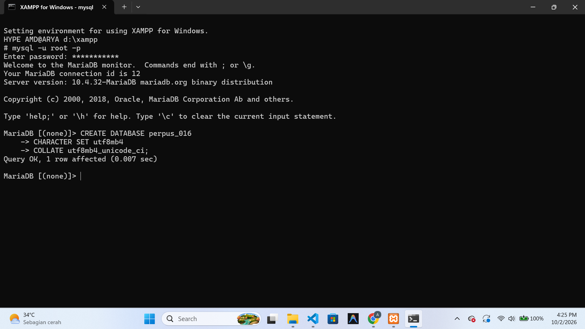
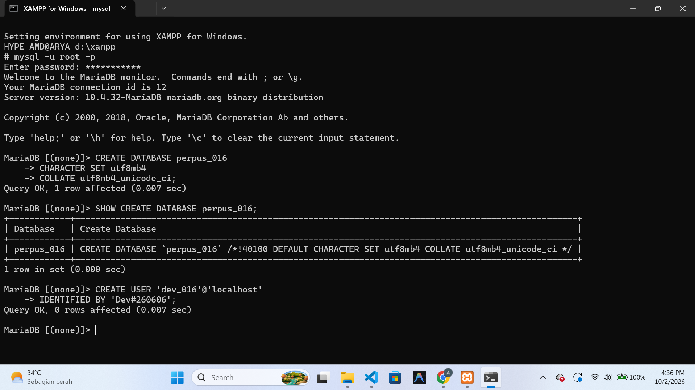
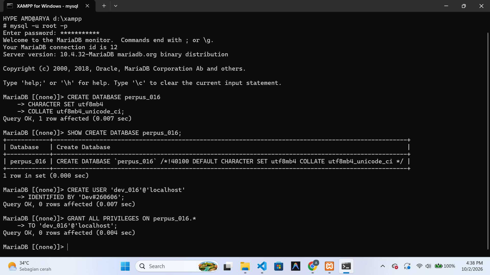
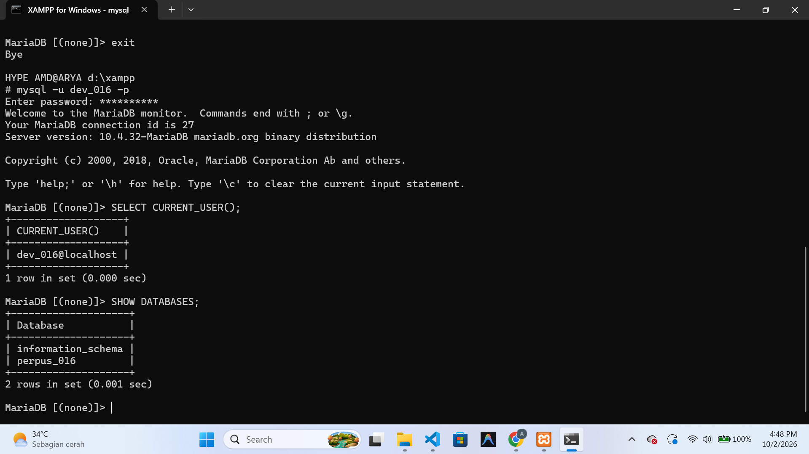
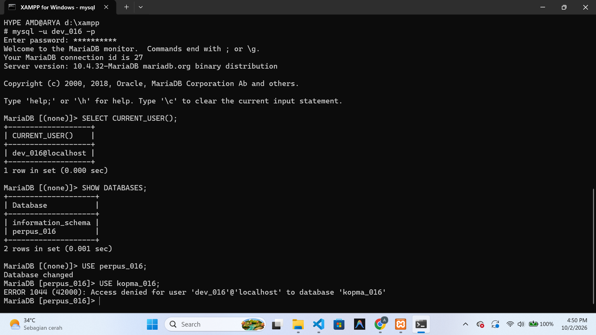
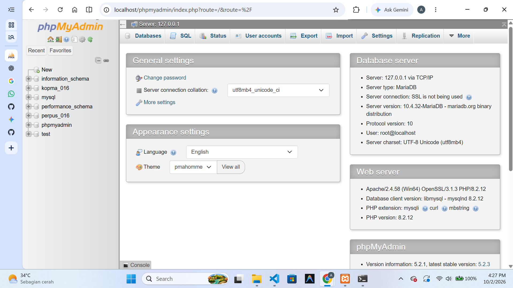
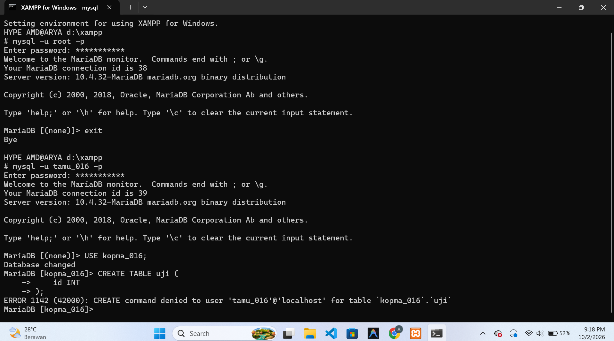
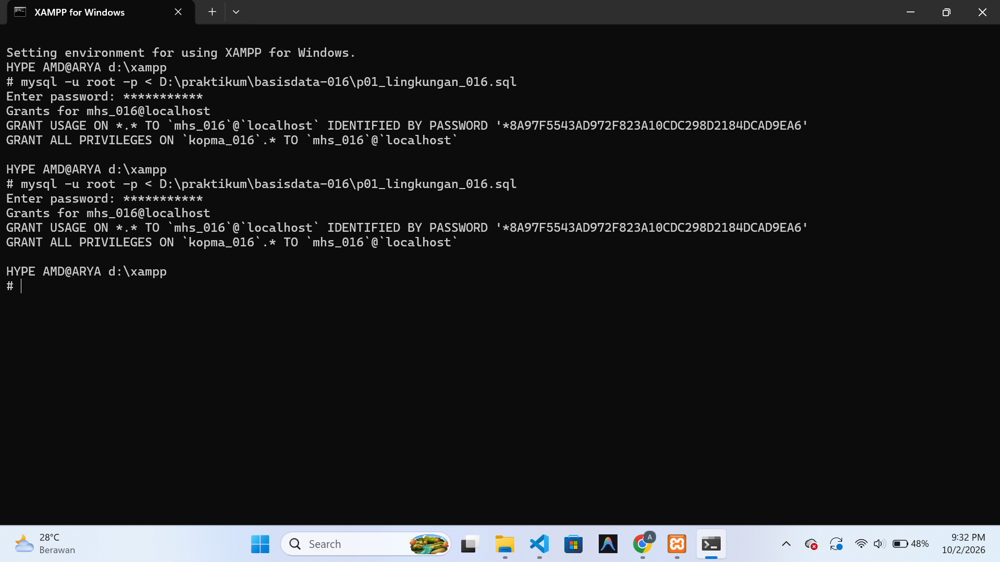
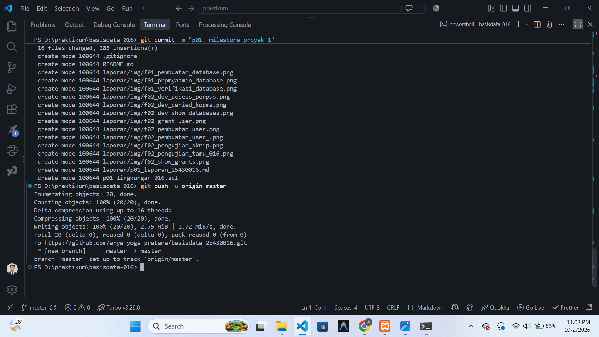

# Laporan Praktikum Basis Data - Pertemuan 1

**Nama:** Arya Yoga Pratama  
**NPM:** 25430016  
**Kelas:** A  
**Tanggal:** 2 Oktober 2026

## 1. Tujuan Praktikum

Praktikum ini bertujuan untuk menyiapkan lingkungan kerja MariaDB menggunakan XAMPP serta memahami proses koneksi dan pengelolaan basis data melalui CLI dan phpMyAdmin.

Selain itu, praktikum dilakukan untuk memahami pengelolaan akun dan hak akses MariaDB, mulai dari pengamanan akun root, pembuatan akun kerja, pemberian privilege pada basis data tertentu, hingga melakukan pengujian terhadap batasan akses tersebut.

Praktikum juga mencakup pembuatan repositori Git dan pencatatan pekerjaan proyek secara bertahap menggunakan Git dan GitHub.

## 2. Ringkasan Dasar Teori

Basis data merupakan kumpulan data yang saling berhubungan dan disimpan secara terorganisasi. Pengelolaan basis data dilakukan menggunakan DBMS yang menyediakan berbagai fasilitas untuk menyimpan, mengatur, dan mengakses data melalui perintah SQL.

MariaDB merupakan DBMS relasional yang digunakan pada praktikum ini. XAMPP digunakan sebagai lingkungan kerja lokal yang menyediakan layanan MariaDB, sedangkan phpMyAdmin menyediakan antarmuka berbasis web untuk mengelola server dan basis data.

Dalam MariaDB terdapat akun dengan hak akses yang berbeda. Akun root memiliki hak administratif yang luas, sedangkan akun kerja dapat diberikan privilege sesuai kebutuhan. Pembatasan privilege digunakan agar suatu akun hanya dapat mengakses sumber daya yang diperlukan.

Git digunakan untuk mencatat perubahan pekerjaan melalui commit, sedangkan GitHub digunakan sebagai repositori daring untuk menyimpan dan mengelola perkembangan proyek.

## 3. Hasil Langkah Percobaan

### 3.1 Pembuatan Basis Data Proyek

Basis data proyek untuk tema Perpustakaan dibuat dengan nama `perpus_016`. Basis data dibuat menggunakan karakter set `utf8mb4` dan collation `utf8mb4_unicode_ci`.

Perintah yang digunakan:

```sql
CREATE DATABASE perpus_016
CHARACTER SET utf8mb4
COLLATE utf8mb4_unicode_ci;

```

**Hasil:**



Gambar menunjukkan proses pembuatan basis data `perpus_016` berhasil dilakukan melalui MariaDB.

### 3.2 Membuat Akun Developer Proyek

Akun developer proyek dibuat dengan nama `dev_016` dan digunakan sebagai akun kerja untuk mengelola basis data proyek `perpus_016`. Akun ini diberikan hak akses pada basis data proyek sesuai kebutuhan pengembangan.

Perintah yang digunakan:

```sql
CREATE USER 'dev_016'@'localhost'
IDENTIFIED BY 'PASSWORD';

```

**Hasil:**



Gambar menunjukkan bahwa akun developer `dev_016` berhasil dibuat pada MariaDB.

### 3.3 Memberikan Hak Akses kepada Akun Developer

Setelah akun `dev_016` berhasil dibuat, akun tersebut diberikan hak akses untuk mengelola basis data proyek `perpus_016`. Pemberian hak akses dilakukan menggunakan perintah `GRANT ALL PRIVILEGES` pada basis data proyek.

Perintah yang digunakan:

```sql
GRANT ALL PRIVILEGES ON perpus_016.*
TO 'dev_016'@'localhost';

```

**Hasil:**



Gambar menunjukkan hasil pemeriksaan hak akses akun `dev_016@localhost`. Akun tersebut memiliki hak `ALL PRIVILEGES` pada basis data `perpus_016`.

### 3.4 Verifikasi Akun Developer

Setelah hak akses diberikan, dilakukan verifikasi untuk memastikan akun `dev_016` dapat digunakan pada basis data proyek `perpus_016`.

Perintah yang digunakan:

```sql
SELECT CURRENT_USER();

```


Gambar menunjukkan hasil verifikasi akun dev_016@localhost dan basis data proyek perpus_016 yang dapat diakses oleh akun tersebut.

### 3.5 Pengujian Pembatasan Hak Akses

Untuk memastikan hak akses akun developer terbatas pada basis data proyek, dilakukan pengujian dengan mencoba mengakses basis data latihan `kopma_016`.

Perintah yang digunakan:

```sql
USE kopma_016;

```


Gambar menunjukkan hasil pengujian hak akses akun dev_016 terhadap basis data kopma_016. Hasil pengujian menunjukkan bahwa akses ditolak dengan ERROR 1044, sesuai dengan pembatasan hak akses yang telah diberikan.

### 3.6 Verifikasi Basis Data melalui phpMyAdmin

Basis data proyek `perpus_016` juga diverifikasi melalui phpMyAdmin. Tampilan phpMyAdmin menunjukkan bahwa server MariaDB telah berjalan dan basis data `perpus_016` telah tersedia.


**Hasil:**  


Gambar menunjukkan tampilan phpMyAdmin pada server MariaDB yang digunakan. Basis data `perpus_016` terlihat pada daftar basis data dan dapat digunakan sebagai basis data proyek.

## 4. Jawaban Titik Analisis

### Titik Analisis 1

Akun `root` digunakan untuk melakukan pengelolaan dan pengaturan MariaDB karena memiliki hak akses yang sangat luas. Untuk pekerjaan sehari-hari, penggunaan akun dengan hak akses terbatas lebih sesuai agar aktivitas pengguna hanya dilakukan pada basis data yang memang diperlukan.

Pada praktikum ini digunakan akun `dev_016` sebagai akun kerja proyek. Akun tersebut diberikan hak akses pada basis data `perpus_016`, sehingga pengelolaan proyek tidak dilakukan menggunakan akun `root`.

### Titik Analisis 2

Akun `dev_016` dapat mengakses basis data `perpus_016` karena hak aksesnya diberikan secara khusus pada basis data tersebut. Hak akses tersebut tidak otomatis berlaku untuk basis data lain yang ada pada server.

Hal ini dibuktikan ketika `dev_016` mencoba menjalankan `USE kopma_016;`. MariaDB menolak permintaan tersebut dan menghasilkan `ERROR 1044`, karena akun `dev_016` tidak mempunyai hak akses pada basis data `kopma_016`.

### Titik Analisis 3

Perbedaan `ERROR 1044`, `ERROR 1045`, dan `ERROR 1142` terletak pada jenis akses yang ditolak oleh MariaDB.

- `ERROR 1044` menunjukkan bahwa akun yang sudah berhasil terhubung ke server tidak memiliki hak akses terhadap basis data tertentu.
- `ERROR 1045` menunjukkan kegagalan autentikasi ketika pengguna mencoba masuk ke MariaDB, misalnya karena password yang digunakan tidak sesuai atau password tidak dikirimkan.
- `ERROR 1142` menunjukkan bahwa pengguna sudah berhasil masuk ke MariaDB, tetapi tidak memiliki hak untuk menjalankan perintah tertentu pada basis data atau tabel.

Dengan demikian, ketiga kode tersebut menunjukkan masalah yang berbeda, yaitu akses terhadap basis data, proses login, dan hak untuk menjalankan operasi tertentu.

### Titik Analisis 4

Mode autentikasi `cookie` pada phpMyAdmin meminta pengguna memasukkan username dan password ketika melakukan login. Dengan cara ini, informasi login tidak dituliskan langsung pada berkas konfigurasi phpMyAdmin.

Sementara itu, mode `config` menggunakan informasi autentikasi yang disimpan pada konfigurasi sehingga phpMyAdmin dapat melakukan login secara otomatis.

Pada praktikum ini digunakan mode `cookie` agar proses login dilakukan secara langsung menggunakan akun yang telah dibuat, seperti `mhs_016` atau akun developer proyek `dev_016`.

## 5. Hasil Latihan dan Modifikasi

### 5.1 Pengujian Hak Akses Akun tamu_016

Akun `tamu_016` digunakan untuk melakukan pengujian terhadap pembatasan hak akses pada basis data `kopma_016`. Setelah berhasil masuk ke basis data, dilakukan percobaan untuk membuat tabel baru menggunakan perintah `CREATE TABLE`.

Perintah tersebut ditolak oleh MariaDB karena akun `tamu_016` hanya memiliki hak akses `SELECT` pada basis data `kopma_016`. Hasil pengujian menghasilkan `ERROR 1142` yang menunjukkan bahwa pengguna tidak memiliki hak untuk menjalankan perintah `CREATE`.

**Hasil:**



Gambar menunjukkan bahwa akun `tamu_016` berhasil menggunakan basis data `kopma_016`, tetapi tidak memiliki izin untuk membuat tabel baru sehingga MariaDB menghasilkan `ERROR 1142`.

### 5.2 Skrip Lingkungan

Skrip lingkungan disimpan dalam berkas `p01_lingkungan_016.sql`. Berkas ini berisi perintah SQL yang digunakan untuk menyiapkan lingkungan praktikum, termasuk pembuatan basis data `kopma_016`, pengaturan akun `mhs_016`, serta pemberian hak akses yang diperlukan.

Skrip juga dibuat agar dapat dijalankan kembali tanpa menimbulkan konflik pada objek yang sudah tersedia. Pengujian dilakukan dengan menjalankan skrip sebanyak dua kali dan hasilnya tetap dapat dijalankan dengan baik.

**Hasil:**



Gambar menunjukkan hasil pengujian skrip lingkungan yang dijalankan kembali. Perintah `SHOW GRANTS` menampilkan hak akses akun `mhs_016` terhadap basis data `kopma_016`.

## 6. Tugas Mandiri: Milestone Proyek 1

Proyek praktikum menggunakan tema Perpustakaan berdasarkan dua digit terakhir NPM.

NPM: 25430016

Dua digit terakhir: 16

Angka 16 termasuk dalam rentang tema Perpustakaan.

Identitas proyek:

| Komponen | Nilai |
|---|---|
| Tema | Perpustakaan |
| Kode Tema | `perpus` |
| Kode 3 Digit | `016` |
| Database | `perpus_016` |
| Akun Kerja | `dev_016` |
| Repository | `basisdata-016` |

Nama organisasi fiktif yang digunakan dalam proyek adalah:

**Perpustakaan Lentera AYP**

Perpustakaan Lentera AYP merupakan organisasi fiktif yang menyediakan layanan pengelolaan anggota, koleksi buku, peminjaman, pengembalian, dan layanan perpustakaan lainnya. Basis data proyek akan dikembangkan secara bertahap untuk mendukung pengelolaan data dan aktivitas utama perpustakaan.

Berkas yang dibuat pada milestone ini:

```text
basisdata-016/
├── README.md
├── p01_lingkungan_016.sql
├── .gitignore
└── laporan/
    ├── p01_laporan_016.md
    └── img/
        ├── f01_pembuatan_database.png
        ├── f01_phpmyadmin_database.png
        ├── f01_verifikasi_database.png
        ├── f02_pembuatan_user_.png
        ├── f02_pembuatan_user.png
        ├── f02_grant_user.png
        ├── f02_show_grants.png
        ├── f02_dev_show_databases.png
        ├── f02_dev_access_perpus.png
        ├── f02_dev_denied_kopma.png
        ├── f02_pengujian_tamu_016.png
        └── f02_pengujian_skrip.png

```

## 7. Pembahasan dan Kendala

Pelaksanaan praktikum Modul 1 memberikan pemahaman mengenai lingkungan kerja MariaDB menggunakan XAMPP, pengelolaan akun pengguna, pemberian hak akses basis data, serta penggunaan phpMyAdmin dan Git. Pada milestone proyek, basis data `perpus_016` berhasil dibuat dan akun `dev_016` berhasil diberikan hak akses pada basis data tersebut. Pengujian juga dilakukan untuk memastikan pembatasan akses akun berjalan sesuai dengan hak yang diberikan.

Selama praktikum terdapat beberapa kendala. Salah satunya adalah terjadinya masalah pada tabel sistem MariaDB yang menyebabkan proses pemberian hak akses sempat menghasilkan `ERROR 1030`. Setelah dilakukan pemeriksaan menggunakan `CHECK TABLE` dan perbaikan dengan `REPAIR TABLE`, proses pemberian hak akses dapat dilakukan kembali.

Kendala lainnya berkaitan dengan pengaturan autentikasi phpMyAdmin. Pengaturan autentikasi kemudian menggunakan mode `cookie` sehingga pengguna dapat melakukan login dengan akun MariaDB yang telah dibuat.

Selain itu, dilakukan pengujian pembatasan hak akses menggunakan akun `tamu_016`. Akun tersebut berhasil masuk ke basis data `kopma_016`, tetapi ketika menjalankan perintah `CREATE TABLE`, MariaDB menolak perintah tersebut dan menghasilkan `ERROR 1142`. Hal ini menunjukkan bahwa hak akses yang diberikan kepada akun tersebut memang terbatas pada operasi yang telah ditentukan.

Secara keseluruhan, kendala selama praktikum dapat diselesaikan melalui pemeriksaan hasil perintah MariaDB, perbaikan tabel sistem, serta pengujian kembali setelah konfigurasi dan hak akses diperbaiki.

## 8. Kesimpulan

Praktikum Modul 1 memberikan pemahaman mengenai penggunaan MariaDB melalui XAMPP, pengelolaan akun pengguna, serta pemberian dan pembatasan hak akses pada basis data. Basis data proyek `perpus_016` dan akun developer `dev_016` berhasil dibuat dan dikonfigurasi sesuai kebutuhan proyek.

Melalui proses pengujian, hak akses pengguna dapat diverifikasi menggunakan beberapa perintah MariaDB. Penggunaan phpMyAdmin dengan autentikasi `cookie` serta Git sebagai pengelola repository juga berhasil diterapkan dalam pelaksanaan praktikum.

Dengan demikian, Milestone Proyek 1 telah dilaksanakan dengan menghasilkan basis data proyek, akun developer, dokumentasi laporan, dan repository proyek yang digunakan sebagai dasar untuk pengembangan pada tahap berikutnya.

## 9. Pernyataan Penggunaan AI

Selama pelaksanaan praktikum, saya memanfaatkan ChatGPT sebagai pendamping untuk membantu memahami materi, menelusuri penyebab kesalahan yang muncul, serta memberikan penjelasan terkait perintah SQL dan penggunaan Git. Pemanfaatan AI dilakukan sebagai sarana pendukung dalam proses belajar, sedangkan setiap perintah dan konfigurasi tetap saya lakukan, uji, dan pastikan hasilnya secara langsung pada lingkungan praktikum MariaDB/XAMPP.

## 10. Bukti Git

Repository praktikum Basis Data digunakan untuk menyimpan berkas praktikum, laporan, dan dokumentasi proyek. Repository yang digunakan adalah:

https://github.com/arya-yoga-pratama/basisdata-25430016

Pada Pertemuan 1 dilakukan commit milestone proyek dengan pesan:

`p01: milestone proyek 1`

**Hash commit:** `a521259`

Commit tersebut digunakan sebagai bukti bahwa berkas dan hasil pengerjaan Milestone Proyek 1 telah disimpan ke repository.

**Bukti Git:**

