# Laporan Praktikum Basis Data - Pertemuan 2

**Nama:** Arya Yoga Pratama  
**NPM:** 25430016  
**Kelas:** A  
**Tanggal:** 5 Oktober 2026

## 1. Tujuan Praktikum

Praktikum Pertemuan 2 bertujuan untuk:

1. Mengidentifikasi aktivitas organisasi, aktor yang terlibat, serta proses bisnis yang berjalan.
2. Mengidentifikasi elemen data, entitas kandidat, dan aturan bisnis berdasarkan dokumen sumber.
3. Menyusun kebutuhan informasi, matriks CRUD, dan kamus data awal.
4. Menentukan kebutuhan data dan informasi yang jelas, spesifik, dan dapat diuji.

## 2. Ringkasan Dasar Teori

Analisis kebutuhan merupakan tahap awal dalam perancangan basis data. Tujuannya adalah untuk memahami bagaimana operasional sebuah organisasi berjalan dan menentukan data apa saja yang perlu dikelola sebelum masuk ke tahap pemodelan data.

Pada tahap ini, pemetaan proses bisnis dilakukan untuk melihat aktivitas mana saja yang menghasilkan atau menggunakan data. Dari proses bisnis dan dokumen sumber yang ada, kita dapat menentukan kandidat entitas, elemen data, hingga aturan bisnis yang berlaku. Selain itu, tahap ini juga merumuskan informasi apa saja yang nantinya dibutuhkan oleh pengguna sistem.

Untuk melihat hubungan antara proses bisnis dan entitas data, digunakan matriks CRUD yang mencakup operasi *Create, Read, Update,* dan *Delete*. Sedangkan untuk detail datanya, disusun sebuah kamus data yang menjabarkan setiap elemen secara rinci, mulai dari arti, contoh penulisan, sumber data, aturan, hingga siapa penanggung jawabnya.

Keseluruhan hasil dari analisis kebutuhan inilah yang nantinya menjadi dasar acuan untuk melanjutkan ke tahap perancangan basis data berikutnya.

## 3. Hasil Langkah Percobaan

### 3.1 Identifikasi Aktor dan Proses Bisnis

Tahap pertama dilakukan dengan mengidentifikasi pihak-pihak yang terlibat dalam kegiatan di Perpustakaan Lentera AYP, serta aktivitas utama yang menghasilkan atau menggunakan data.

Dari hasil identifikasi tersebut, terdapat tiga aktor yang terlibat, yaitu Anggota, Petugas Perpustakaan, dan Kepala/Pengelola Perpustakaan. Selanjutnya, dari aktivitas yang ada diperoleh tujuh proses bisnis yang diberi kode PB-01 sampai PB-07.

**Bukti:**

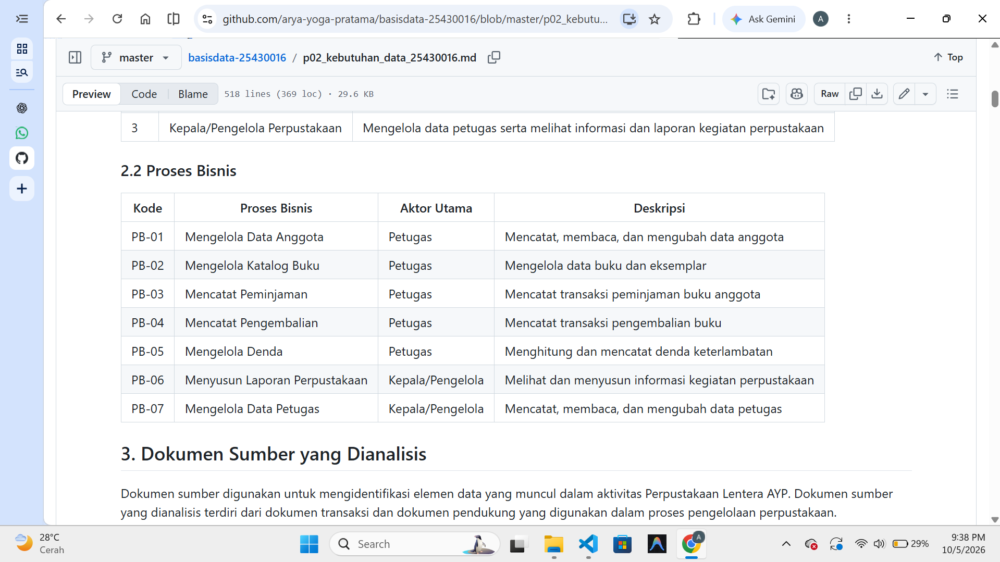

### 3.2 Identifikasi Dokumen Sumber

Tahap berikutnya adalah mengidentifikasi dokumen sumber yang digunakan untuk menemukan elemen data yang dibutuhkan dalam proses perpustakaan.

Dokumen yang dianalisis meliputi Formulir Pendaftaran Anggota, Data Katalog Buku, Data Eksemplar Buku, Data Petugas, Slip Peminjaman Buku, Catatan Pengembalian, dan Kuitansi Denda.

**Bukti:**

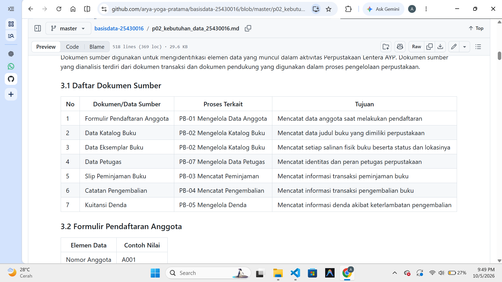

### 3.3 Identifikasi Entitas dan Elemen Data

Berdasarkan proses bisnis dan dokumen sumber, dilakukan identifikasi terhadap entitas kandidat beserta elemen data yang diperlukan.

Dari hasil analisis tersebut, diperoleh delapan entitas, yaitu Anggota, Buku, Eksemplar, Petugas, Peminjaman, Detail_Peminjaman, Pengembalian, dan Denda.

**Bukti:**

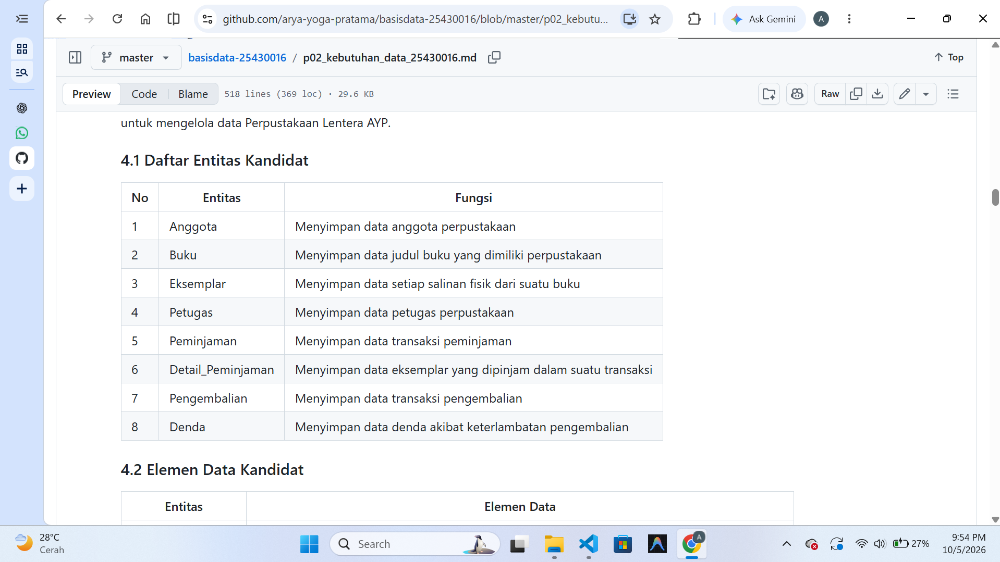

### 3.4 Penyusunan Aturan Bisnis dan Kebutuhan Informasi

Selanjutnya, disusun aturan bisnis yang digunakan untuk menentukan ketentuan dalam pengelolaan data serta kebutuhan informasi yang perlu tersedia bagi pengguna perpustakaan.

Dari hasil penyusunan tersebut, diperoleh 10 aturan bisnis dan 8 kebutuhan informasi.

**Bukti:**

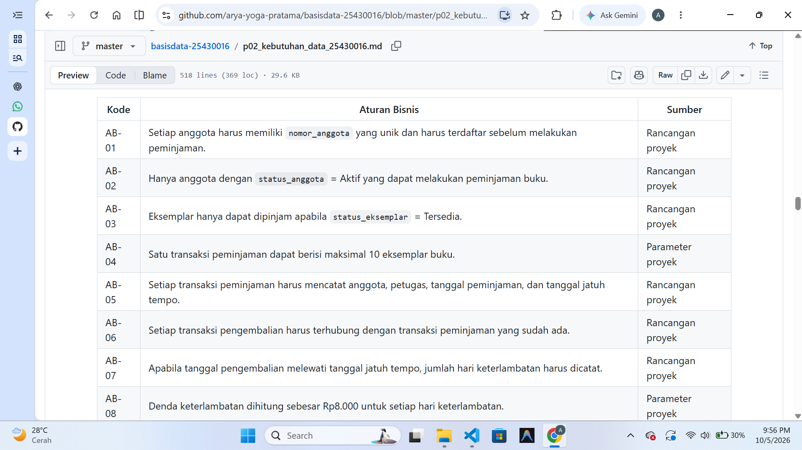

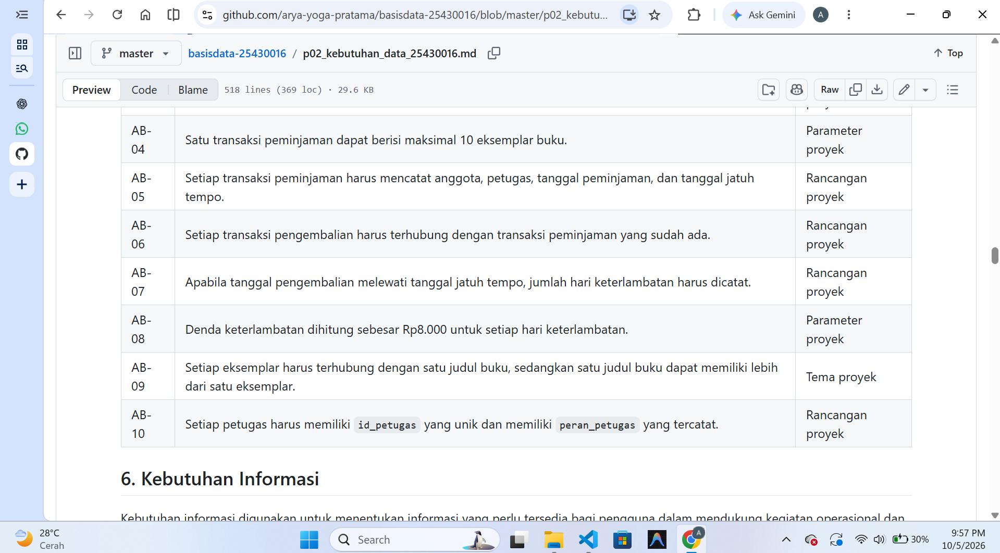

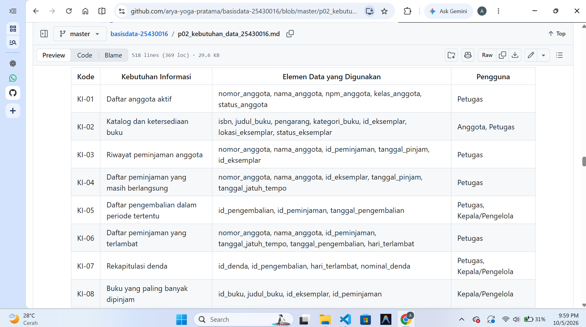

### 3.5 Penyusunan Matriks CRUD

Matriks CRUD disusun untuk melihat hubungan antara proses bisnis dengan entitas data yang dikelola.

Dari hasil pemetaan tersebut, seluruh entitas memiliki proses yang menghasilkan data sehingga tidak ditemukan entitas yatim dalam rancangan.

**Bukti:**

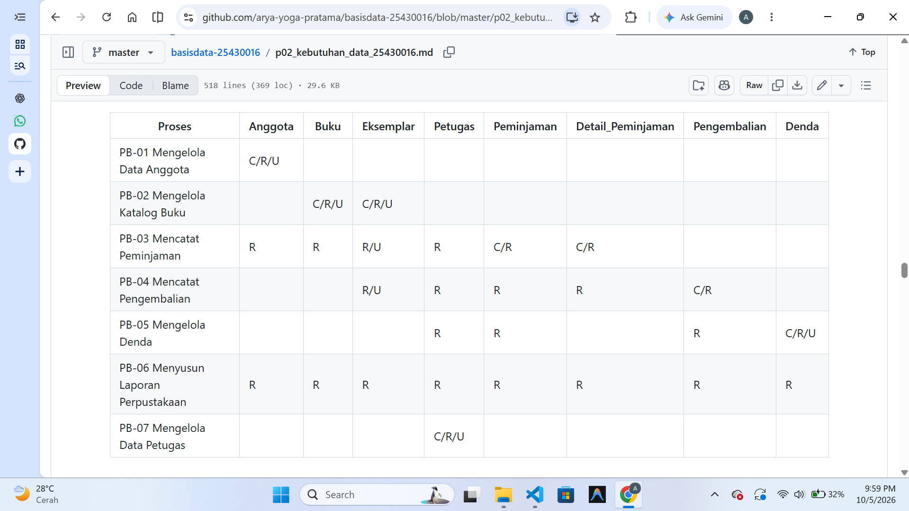

### 3.6 Penyusunan Kamus Data Awal

Tahap terakhir adalah menyusun kamus data awal untuk menjelaskan elemen data yang digunakan dalam proyek.

Dari hasil penyusunan tersebut, diperoleh 25 elemen data unik yang dilengkapi dengan arti, contoh nilai, sumber, aturan pengisian, dan penanggung jawab data.

**Bukti:**

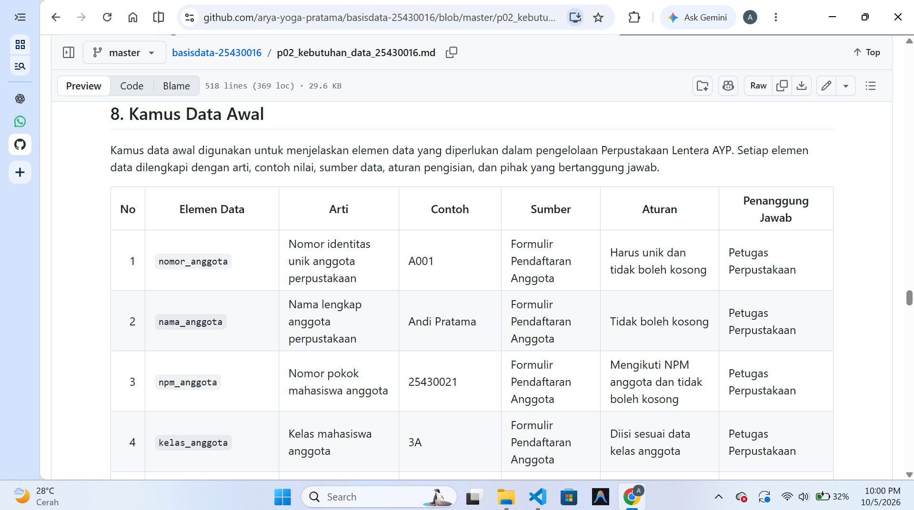

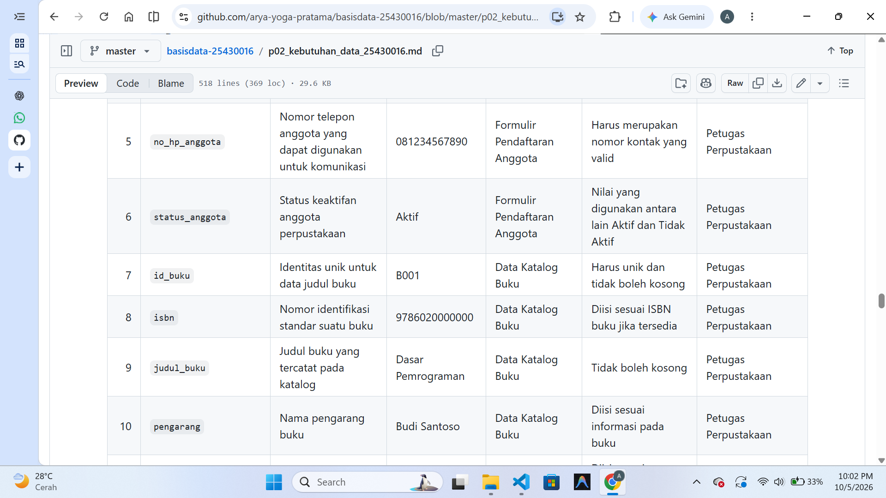

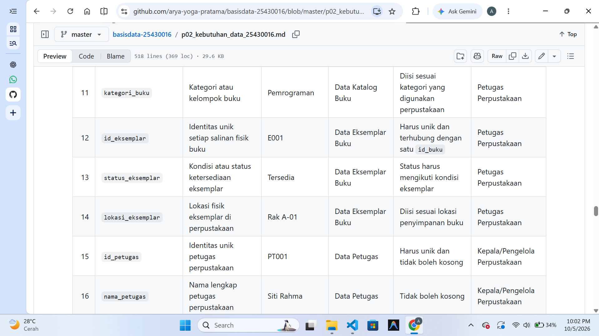

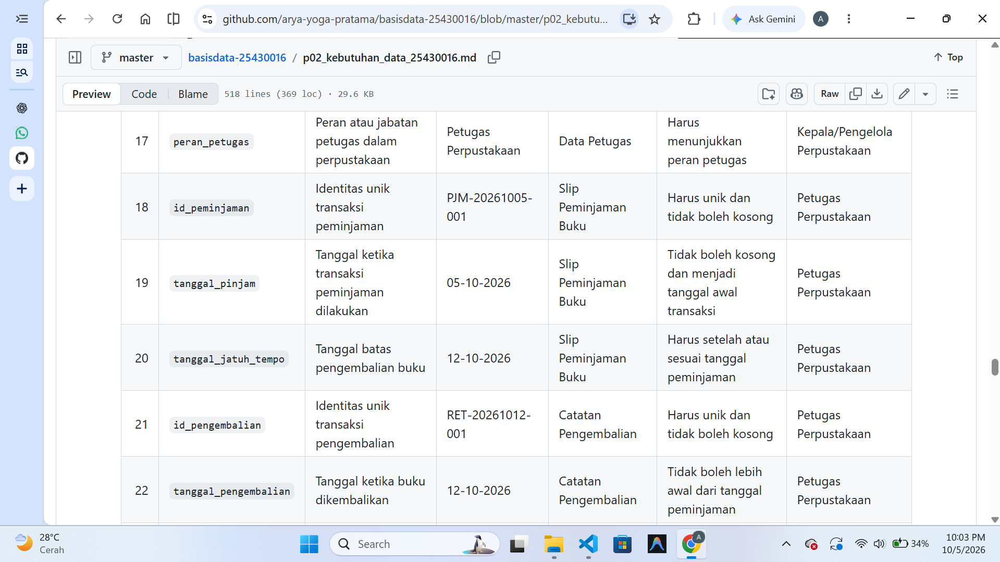

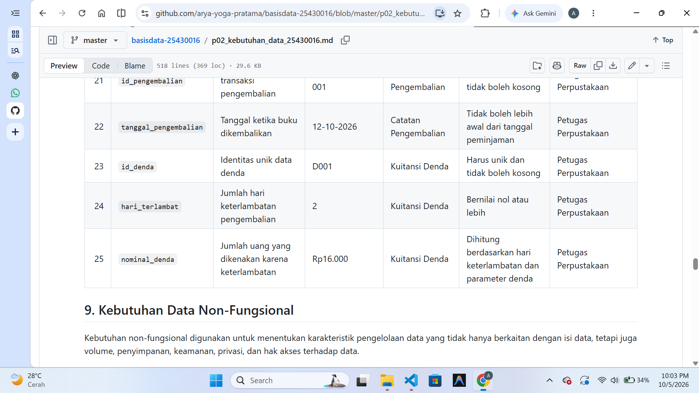

## 4. Jawaban Titik Analisis

### TA-1 — Data Historis

Data historis diperlukan untuk mempertahankan informasi transaksi yang sudah terjadi sehingga riwayat kegiatan perpustakaan tetap dapat ditelusuri.

Pada proyek Perpustakaan Lentera AYP, data seperti `id_peminjaman`, `tanggal_pinjam`, `tanggal_jatuh_tempo`, `id_pengembalian`, `tanggal_pengembalian`, `hari_terlambat`, dan `nominal_denda` perlu dipertahankan sebagai bagian dari riwayat transaksi.

Data transaksi tidak dihapus setelah proses transaksi selesai. Hal ini dilakukan agar riwayat peminjaman, pengembalian, dan denda tetap tersedia untuk pemeriksaan maupun penyusunan laporan.

Untuk data master yang sudah tidak aktif, status data dapat diubah tanpa harus menghapus data historis yang berkaitan dengan transaksi sebelumnya.

### TA-2 — Data Turunan

Data turunan merupakan data yang dapat diperoleh melalui proses perhitungan berdasarkan data yang sudah tersedia.

Pada proyek Perpustakaan Lentera AYP, `hari_terlambat` dapat ditentukan dari selisih antara `tanggal_pengembalian` dan `tanggal_jatuh_tempo`. Selanjutnya, `nominal_denda` dapat dihitung berdasarkan jumlah hari keterlambatan dan parameter denda harian.

Dalam rancangan ini, `hari_terlambat` dan `nominal_denda` tetap dicatat pada entitas **Denda**. Keputusan tersebut diambil agar nilai yang diterapkan pada transaksi dapat ditelusuri kembali dan tetap tersedia untuk kebutuhan riwayat maupun laporan denda.

Dengan demikian, data denda tetap memiliki hubungan dengan transaksi pengembalian sehingga dapat diperiksa kembali apabila diperlukan.

### TA-3 — Pemeriksaan Matriks CRUD

Matriks CRUD digunakan untuk melihat hubungan antara proses bisnis dengan entitas data yang dikelola. Pemeriksaan dilakukan untuk memastikan setiap entitas memiliki proses yang dapat membuat data.

Hasil pemeriksaan terhadap matriks CRUD Perpustakaan Lentera AYP adalah sebagai berikut:

| Entitas | Proses yang Membuat Data |
|---|---|
| Anggota | PB-01 |
| Buku | PB-02 |
| Eksemplar | PB-02 |
| Petugas | PB-07 |
| Peminjaman | PB-03 |
| Detail_Peminjaman | PB-03 |
| Pengembalian | PB-04 |
| Denda | PB-05 |

Berdasarkan pemeriksaan tersebut, seluruh entitas memiliki operasi **Create** dan tidak ditemukan entitas yang tidak memiliki proses pembentukan data.

Operasi **Delete** tidak digunakan pada rancangan ini untuk data yang berkaitan dengan riwayat transaksi. Data yang sudah tidak aktif tetap dipertahankan dan dapat diperbarui statusnya tanpa menghapus riwayat transaksi.

Dengan demikian, matriks CRUD menunjukkan bahwa seluruh entitas memiliki proses bisnis yang jelas sebagai sumber pembentukan datanya.

## 5. Hasil Latihan dan Modifikasi

### 5.1 Perhitungan Parameter P

Dua digit terakhir NPM yang digunakan adalah **16**.

Perhitungan parameter P dilakukan sebagai berikut:

P = (16 mod 9) + 1  
P = 7 + 1  
P = 8

Berdasarkan hasil tersebut, nilai P yang diperoleh adalah **8**, sehingga didapatkan beberapa parameter berikut:

- Maksimal item per transaksi = P + 2 = 10 eksemplar.
- Parameter denda harian = Rp8.000.
- Perkiraan volume transaksi harian = 40 + (5 × P) = 80 transaksi/hari.

Parameter tersebut selanjutnya digunakan sebagai dasar dalam rancangan proyek Perpustakaan Lentera AYP.

### 5.2 Perbaikan Pernyataan Kebutuhan yang Masih Kabur

#### Requirement 1 — Keamanan Data Anggota

**Pernyataan awal:**  
"Data anggota harus aman."

**Perbaikan:**  
Data `no_hp_anggota` hanya dapat diakses oleh Petugas Perpustakaan dan Kepala/Pengelola Perpustakaan.

**Pengujian:**  
Memastikan pengguna yang tidak memiliki hak akses tidak dapat melihat data `no_hp_anggota`.

#### Requirement 2 — Kecepatan Pencarian Buku

**Pernyataan awal:**  
"Sistem harus cepat mencari buku."

**Perbaikan:**  
Pencarian buku berdasarkan `id_buku`, `isbn`, atau `judul_buku` harus menampilkan hasil maksimal dalam waktu 3 detik.

**Pengujian:**  
Melakukan pencarian berdasarkan salah satu parameter tersebut, kemudian mengukur waktu yang dibutuhkan sampai hasil pencarian ditampilkan.

#### Requirement 3 — Keakuratan Laporan Stok

**Pernyataan awal:**  
"Laporan stok harus akurat."

**Perbaikan:**  
Informasi ketersediaan buku harus sesuai dengan status terbaru setiap `Eksemplar` setelah transaksi peminjaman atau pengembalian dicatat.

**Pengujian:**  
Setelah transaksi peminjaman atau pengembalian dicatat, memeriksa apakah status `Eksemplar` dan informasi ketersediaan buku sudah berubah sesuai dengan transaksi.

## 6. Tugas Mandiri: Milestone Proyek 2

Pada Milestone Proyek 2, dilakukan analisis kebutuhan data untuk proyek **Perpustakaan Lentera AYP**. Analisis ini mencakup aktivitas organisasi, aktor dan proses bisnis, dokumen sumber, entitas kandidat, aturan bisnis, kebutuhan informasi, matriks CRUD, kamus data awal, kebutuhan non-fungsional, serta potensi masalah pada kualitas data.

Hasil analisis tersebut disusun dalam file:

`p02_kebutuhan_data_25430016.md`

Milestone ini menghasilkan beberapa hal berikut:

- 7 proses bisnis (PB-01 sampai PB-07).
- 8 entitas kandidat.
- 10 aturan bisnis (AB-01 sampai AB-10).
- 8 kebutuhan informasi (KI-01 sampai KI-08).
- Matriks CRUD untuk seluruh proses bisnis dan entitas.
- Kamus data awal yang memuat 25 elemen data.
- Kebutuhan non-fungsional yang berkaitan dengan volume transaksi, retensi data, dan hak akses.
- Identifikasi potensi masalah kualitas data.
- Analisis data historis, data turunan, dan pemeriksaan matriks CRUD.

Milestone ini juga menggunakan parameter P berdasarkan dua digit terakhir NPM. Untuk NPM 25430016, diperoleh nilai P = 8 yang digunakan untuk menentukan batas item transaksi, parameter denda, dan estimasi volume transaksi harian.

File milestone ini kemudian menjadi dasar untuk melanjutkan ke tahap perancangan basis data pada pertemuan berikutnya.

## 7. Pembahasan dan Kendala

### 7.1 Pembahasan

Pada praktikum Pertemuan 2, dilakukan analisis kebutuhan data untuk proyek Perpustakaan Lentera AYP. Analisis dimulai dengan mengidentifikasi aktor dan proses bisnis, kemudian dilanjutkan dengan menentukan dokumen sumber, entitas kandidat, elemen data, aturan bisnis, serta kebutuhan informasi.

Matriks CRUD kemudian disusun untuk melihat hubungan antara proses bisnis dan entitas data, sekaligus memastikan setiap entitas memiliki proses yang dapat membentuk dan menggunakan data. Dari hasil pemeriksaan, seluruh entitas yang digunakan dalam rancangan memiliki proses pembentukan data.

Kamus data awal juga disusun untuk memberikan penjelasan mengenai elemen data yang akan dikelola, termasuk sumber data dan pihak yang bertanggung jawab terhadap data tersebut.

Selain itu, kebutuhan non-fungsional digunakan untuk menentukan beberapa aspek yang perlu diperhatikan dalam sistem, seperti volume transaksi, retensi data, serta pembatasan akses terhadap data pribadi anggota.

### 7.2 Kendala

Beberapa kendala yang ditemukan selama praktikum adalah:

1. Menentukan batas antara proses bisnis dan entitas agar tidak terjadi kesalahan dalam mengidentifikasi kebutuhan data.
2. Menentukan elemen data yang benar-benar diperlukan serta menghindari data yang tidak memiliki fungsi dalam proses bisnis.
3. Menentukan hubungan antara proses bisnis dan entitas saat menyusun matriks CRUD.
4. Menentukan aturan pengelolaan data historis agar transaksi yang sudah terjadi tetap dapat ditelusuri.
5. Menentukan kebutuhan akses terhadap data pribadi anggota.

Kendala tersebut diselesaikan dengan memeriksa kembali proses bisnis, dokumen sumber, aturan bisnis, dan matriks CRUD. Pemeriksaan ini dilakukan agar hasil analisis tetap saling berhubungan dan tidak ada kebutuhan data yang terlewat.

## 8. Kesimpulan

Praktikum Pertemuan 2 menghasilkan analisis kebutuhan data untuk proyek Perpustakaan Lentera AYP. Analisis dilakukan dengan mengidentifikasi aktor, proses bisnis, dokumen sumber, entitas kandidat, elemen data, aturan bisnis, dan kebutuhan informasi.

Hasil analisis tersebut kemudian dituangkan dalam matriks CRUD dan kamus data awal untuk melihat hubungan antara proses bisnis dan data yang dikelola. Selain itu, kebutuhan non-fungsional serta potensi masalah kualitas data juga telah diidentifikasi sebagai bahan pertimbangan untuk tahap berikutnya.

Berdasarkan hasil analisis yang telah dilakukan, kebutuhan data pada proyek Perpustakaan Lentera AYP sudah memiliki dasar yang cukup untuk dilanjutkan ke tahap perancangan basis data pada pertemuan berikutnya.

## 9. Pernyataan Penggunaan AI

Dalam pengerjaan praktikum ini, AI digunakan sebagai alat bantu untuk memahami materi, memeriksa hasil pekerjaan, dan memperbaiki dokumentasi laporan.

AI digunakan untuk:

1. Membantu memahami konsep analisis kebutuhan data, proses bisnis, entitas, aturan bisnis, kebutuhan informasi, dan matriks CRUD.
2. Membantu menjelaskan kesalahan atau bagian materi yang belum dipahami selama pengerjaan.
3. Membantu memeriksa struktur dan konsistensi hasil analisis yang telah dibuat.
4. Membantu merapikan penyusunan laporan serta memberikan saran pada bagian yang masih perlu diperbaiki.

Hasil akhir tetap diperiksa dan disesuaikan dengan kebutuhan proyek Perpustakaan Lentera AYP serta materi yang terdapat dalam modul praktikum.

## 10. Bukti Git

Repository GitHub proyek praktikum:

**Repository:** `basisdata-25430016`

**Tautan:**  
https://github.com/arya-yoga-pratama/basisdata-25430016

Commit yang digunakan sebagai bukti pengerjaan:

b9b2469 — p02: milestone proyek 2

File Milestone Proyek 2 yang dikerjakan:

`p02_kebutuhan_data_25430016.md`

Bukti Git digunakan untuk menunjukkan riwayat pengerjaan dan perubahan file pada repository proyek.

## Checklist

- [x] Tujuan praktikum
- [x] Ringkasan dasar teori
- [x] Screenshot hasil langkah percobaan
- [x] Jawaban titik analisis
- [x] Hasil latihan dan modifikasi
- [x] Milestone Proyek 2
- [x] Pembahasan dan kendala
- [x] Kesimpulan
- [x] Pernyataan penggunaan AI
- [x] Bukti Git
- [x] Screenshot PB, AB, KI, CRUD, dan kamus data
- [x] Commit dan push laporan Pertemuan 2